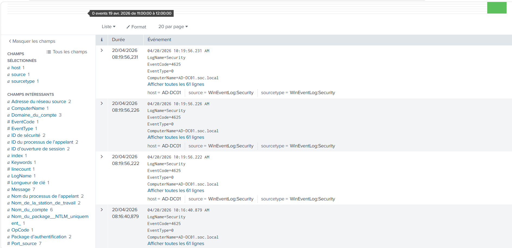
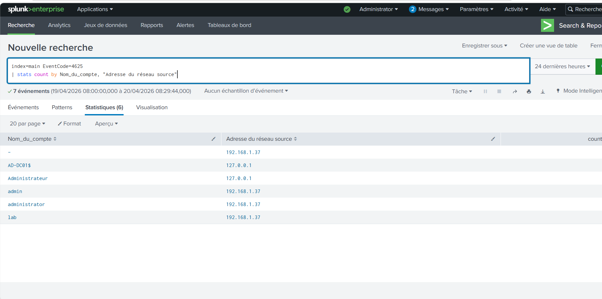

# soc-lab-detection
LAB SOC - Détection d'attaques (Brute force, Latéral mouvement, Privilège escalation) avec Splunk et Active Directory

Attaque Brute Force

Cette capture montre plusieurs tentatives de connexion échouées (Event ID 4625) sur le contrôleur de domaine.

Cela indique une possible attaque de type brute force ciblant plusieurs comptes.

## Détection brute force (Splunk)

Recherche utilisée :

index=main EventCode=4625
| stats count by Nom_du_compte, "Adresse du réseau source"

Cette analyse montre plusieurs tentatives échouées depuis une même IP (192.168.1.37).

Cela indique une attaque brute force ciblant plusieurs comptes.

